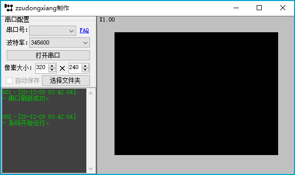

# 串口发送图像

通过自定义串口通信协议实现STM32采集的图像发送到上位机查看

`开发平台`: VS2019, Keil 5

`开发技术`: C#, WinForm, C++

`使用到的技术`: STM32, SerialPort, Winform

---

需要提前指定要发送的图像大小, 否则会出现解析失败的情况

右侧显示的图像可以实现自由的缩放, 通过鼠标滚轮可以轻易的实现缩放操作

## 其他

1. 本软件于2017年9月左右编写, 2019年才编写README, 很多地方介绍不是很详细
2. 如果有任何疑问欢迎下载源码讨论
3. 有其他疑问也可联系[作者](maileto:zzudongxiang@163.com)